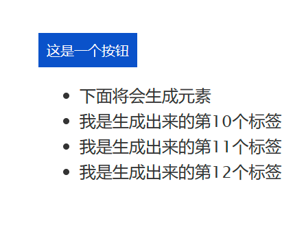

## 使用JavaScript动态修改页面：
到这个时候，大家应该已经学会JavaScript这门编程语言最基本的语法了（条件、循环、常用对象等）。而在开发中，使用JS的难点主要集中在异步、事件监听、[DOM](https://www.w3schools.com/js/js_htmldom.asp)上面，他们实现的，也就是页面元素的动态修改

## 目标：
- 认识JavaScript中的DOM
- 熟悉使用JS对页面元素的操作
- 熟悉添加事件监听的流程

## 任务：
1. 写一个按钮，当你点击按钮时，按钮下方出现一个 \ 标签，然后在3秒钟后，这个标签被删除
2. 示例：

## 要求：
- 此次任务属于简单地使用 JavaScript 的高级用法
- 在5～7天内完成任务闭环
- 验收：
  1. 向群相册上传你的 JS 代码截图
  2. 向群相册上传你 HTML 文件的截图

## 参考:
- 本目录下的两个由 ChatGPT 生成的API文档
- [认识DOM](https://juejin.cn/post/7205957899653742651)
- [官方文档](https://www.w3schools.com/js/js_htmldom.asp)
- [ 一篇文章搞懂前端事件监听](https://juejin.cn/post/7104055238700892197)