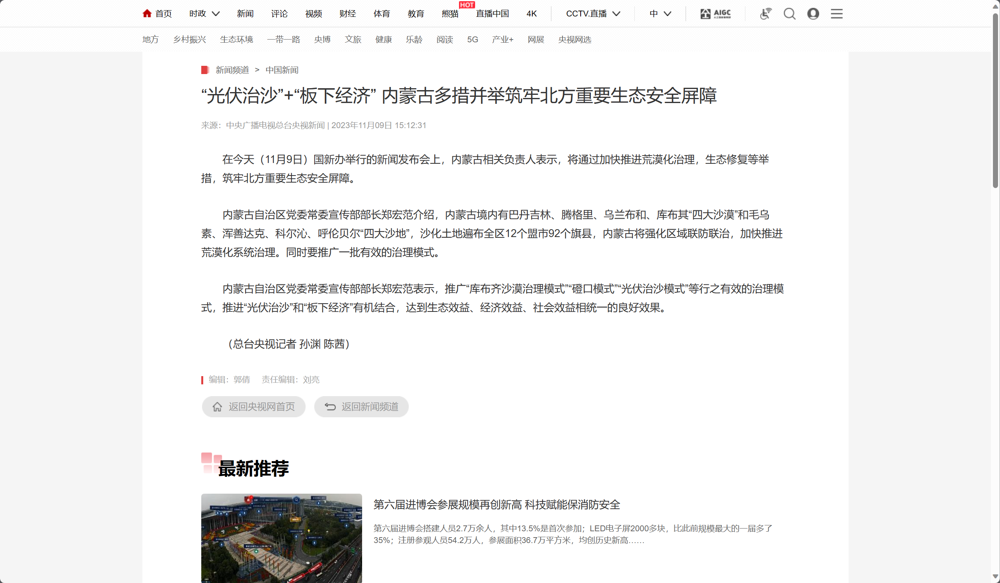

## 试着写一个页面 并上传到github上：
（首先，我们得先学会“抄”页面，“抄代码”，才有自己能写的可能）

## 目标：
- 熟悉使用“页面检查”
- 熟悉GitHub仓库的创建和管理
- 掌握HTML和CSS的简单使用

## 任务：
1. 使用HTML和CSS写一个“中国新闻_央视网(cctv.com)”新闻详情页的静态页面
2. 合理使用 github 进行版本管理

## 要求：
- 此次任务属于简单地练习前端，合理地运用HTML和CSS
- 4～6天内完成任务闭环
- 验收：（图片名字以自己的真名命名）
  1. 向群相册上传你的静态页面图片
  2. 向群相册上传你HTML文件的截图

## 建议：
- 合理使用 [snipaste](https://zh.snipaste.com/) 等截图软件快速拾取颜色
- 熟练使用“页面检查”工具（浏览器里按F12打开）了解页面的布局，参考页面样式
- 尝试使用 PxCook 标记页面布局进行快速开发

## 参考:
- [样例新闻](https://news.cctv.com/2023/11/09/ARTIfUIHff3QidzgLfM5d2Id231109.shtml?spm=C94212.PBZrLs0D62ld.EKoevbmLqVHC.15)
- [mdn](https://developer.mozilla.org/zh-CN/docs/Web)
- [W3school](https://www.w3school.com.cn/index.html)
-  [**PxCook** - 高效易用的自动标注工具](https://www.fancynode.com.cn/pxcook)
- [黑马程序员前端基础 ](https://www.bilibili.com/video/BV1kM4y127Li/?spm_id_from=333.999.0.0)

